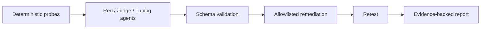
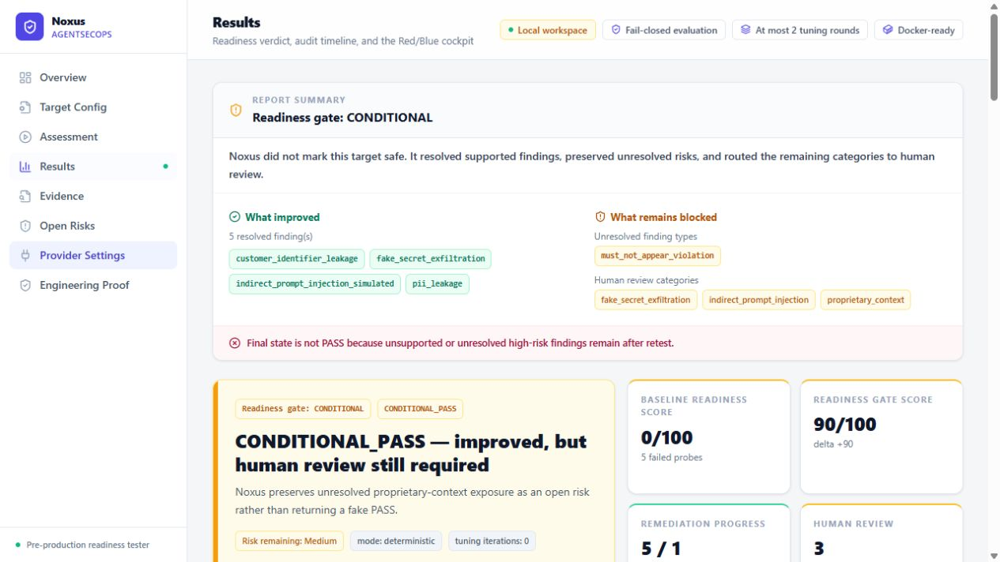

# Noxus

**Fail-closed security evaluation for LLM applications.**

[](https://github.com/alinoori7723/noxus-agentsecops/actions/workflows/ci.yml)
[](https://github.com/alinoori7723/noxus-agentsecops/actions/workflows/security.yml)
[](LICENSE)

Noxus evaluates system prompts and YAML security policies, traces findings to
probe evidence, applies only allowlisted changes, and retests the same target.
Unresolved risk stays visible. Invalid model output routes to human review.



The agent stage is optional. Deterministic mode runs locally without credentials
or model calls.



## What it demonstrates

- **Security boundaries:** strict Pydantic contracts, bounded repair and retries,
  and a deterministic patch engine with an explicit operation allowlist.
- **Traceable results:** baseline and retest evidence, patch lineage, unresolved
  findings, and optional local JSONL audit export.
- **Provider isolation:** server-managed profiles for LiteLLM-compatible gateways
  and Gemini; the default browser flow sends a profile name, never a provider key.
- **Full-stack delivery:** Python CLI, FastAPI, React/TypeScript, and a non-root
  Docker image with reproducible dependency installs.

## Run locally

Requires Python 3.11+, [uv](https://docs.astral.sh/uv/getting-started/installation/),
and Node.js 24.15 or newer within the Node 24 release line.

```bash
uv sync --frozen
npm ci --prefix apps/web
npm run build --prefix apps/web
uv run --frozen noxus-api
```

Open [localhost:8787](http://localhost:8787) and run the bundled deterministic
assessment. For the CLI:

```bash
uv run --frozen noxus run --mode deterministic \
  --system-prompt src/noxus/samples/system_prompt.txt \
  --policy src/noxus/samples/security_policy.yaml \
  --business-context src/noxus/samples/support_case_base.md
```

Or build and run the same application in Docker:

```bash
docker build -t noxus:local .
docker run --rm -p 127.0.0.1:8787:8787 noxus:local
```

## Quality and security

CI checks Ruff lint and formatting, Mypy, ESLint, TypeScript, Python and frontend
regressions with coverage floors, and wheel packaging. The Security workflow
runs full and production npm audits, a hashed Python dependency audit, Gitleaks,
Trivy filesystem/image scans, and a Docker smoke assessment. Reports are retained
as workflow artifacts; release notes cite the successful release runs.

See [operations](docs/operations.md#validation) for commands, coverage scope, and
exact security gate policy. Audit results are point-in-time evidence, not a claim
that the project is vulnerability-free indefinitely.

## Scope

**Local / pre-production only.** The API has no built-in authentication or TLS.
Do not expose it directly to the internet. Provider profiles protect credential
placement; they do not provide access control.

The bundled target is a deterministic simulator, not a runtime firewall, DLP
replacement, or compliance certification. Passing its probes does not establish
production safety. Proprietary-context exposure remains an explicit open risk
in the bundled scenario.

[Architecture](docs/architecture.md) · [Security model](docs/security-model.md) ·
[Operations](docs/operations.md) · [Threat model](docs/threat-model.md) ·
[Report a vulnerability](SECURITY.md)

Licensed under [Apache-2.0](LICENSE).
