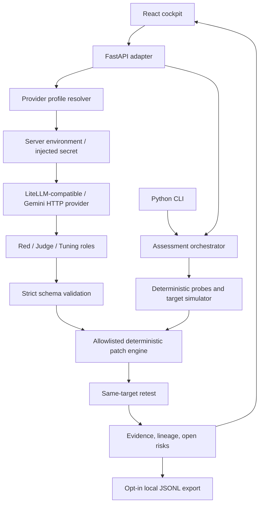

# Architecture

The CLI and HTTP API share one assessment core. Framework-specific code is
confined to `api_server.py`; provider HTTP clients use the standard library.

## Assessment path

1. `policy_loader.py` parses and validates target policy.
2. `probe_registry.py`, `target_simulator.py`, and `evaluator.py` establish the
   deterministic baseline.
3. Optional agents propose probes, semantic judgments, or patch operations.
   `json_contracts.py` validates their output with at most one repair attempt.
4. `patch_engine.py` enforces the operation and policy-path allowlists.
5. `orchestrator.py` retests the patched configuration and limits tuning to two
   iterations. `remediation.py` tracks each unresolved finding and patch lineage.
6. `report.py` and `ui_formatters.py` expose the same evidence to CLI and web.

## Provider selection

The browser sends `provider_profile`. `provider_profiles.py` resolves a
server-owned configuration and reads its named credential from the environment.
The client cannot override the profile's endpoint, models, or credential.
Only profile names and provider types appear in the profile catalog.

Manual request credentials are an explicit native local-development option.
They require both server opt-in and a loopback peer. Proxy forwarding headers
are not trusted to determine that peer.

## Packaging and state

The image builds the React application with Node 24, builds the Python wheel
using locked tools, and installs hashed runtime dependencies into a virtual
environment. The final Python 3.11 Alpine image runs as a non-root user; build and package
installation tools are removed from the runtime.

Inputs and results live in process and component state. Optional audit exports
are confined to the configured audit directory. Built static assets are served
from an explicit root; traversal and unknown SPA routes return 404.

## HTTP interface

| Endpoint | Purpose |
| --- | --- |
| `GET /api/health` | Process health |
| `GET /api/proof` | Structural safeguards; optional operator-supplied test metadata |
| `GET /api/sample-inputs` | Synthetic bundled target inputs |
| `GET /api/providers` | Public profile names/types and local manual-key availability |
| `POST /api/providers/test` | Live per-role schema diagnostics |
| `POST /api/assessments/run` | Deterministic or agent-assisted assessment |
| `POST /api/audit/export-local` | Opt-in report export to a confined JSONL filename |
